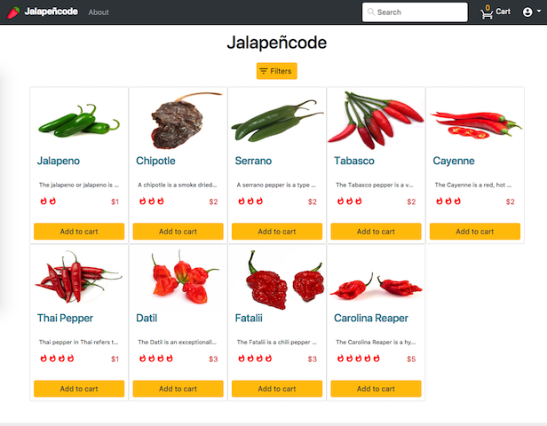

# Jalapeñcode
Jalapeñcode is a project for CSUF CPSC 362 - Foundations of Software Engineering Fall 2017.

### Members
awathas, FieridNeil, jeffroliv, mhy001

We are creating an online shopping cart for chili peppers.


### Technology Profile / Dependencies
* PHP 7.1
* MySQL 5.7
* Bootstrap 4.0
* jQuery 3.2

### Set up
#### OSX
Install Homebrew. Use homebrew to install PHP and MySQL. Run bash scripts db_prep and start.

#### Windows
The easiest set up is to install a pre-bundled package such as AppServ.

Optionally, each technology can be installed separately. Install PHP. Install MySQL following the development path. At the time of this writing, PHP 7.1.10 and MySQL 5.7.16 were used. Add the path to the PHP install to user or environment _$PATH_. Create a copy of _php.ini-development_ and rename it as _php.ini_. Uncomment the following lines:

* extension_dir = "ext"
* extension=php_mysqli.dll

#### Post-install activities
Launch the MySQL server and run queries in db_prep.php to create the database with initial data. Remember to set your credentials in _data/config.php_.

#### Running with PHP built-in server
In terminal/command prompt, navigate to the project's root. Type ```php -S localhost:8080 -t public/```. Open a web browser at localhost:8080 to view the project.

#### Running with Apache HTTPD
If this project is the only project, open _httpd.conf_ and point _DocumentRoot_ to the project's public folder. For the directory, change ```AllowOverride None``` to ```AllowOverride All_```. Open a web browser at localhost to view the project.

If this project is not the only project, open _httpd.conf_ and add:
```
Alias "/jalapencode" "PATH_TO_PROJECT/public"
<Directory "PATH_TO_PROJECT/public">
    AllowOverride All
    Require all granted
</Directory>
```
Open a web browser at localhost/jalapencode to view the project.

In the case of separate installs, modify httpd.conf to enable PHP.

Under the public folder, add a htaccess file with:
```
FallbackResource index.php
```

### Project management & Issue tracking
https://trello.com/b/w4mvuNog/cs-362

###### Phase 1
* Gather product information (name, image, description, ...)
* Set up web server & database
* Create simple webpage to display products

###### Phase 2
* Add shopping cart
* Add checkout
* Add product search/filter

###### Phase 3
* Add user accounts
